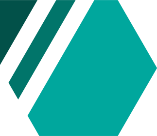

 
  
 <h1 size="+2">Code Snippets</h1>
 <h4><i>A crud database web app to store and retrieve snippets of code.</i></h4>

 

    
    
    
    

 
 

 

## Objective

Become more familiar with the MERN stack. Specifically:

- Node.js
- MongoDB
- Express.js
- React Router

## Additional Learning Outcomes

Improved understanding of the following:

- Component life cycles
- Application Structure
- Digital Ocean Droplets
- Aspects of Design
- Ubuntu

## Live Website

www.roddo.xyz :zap:

## Author

- Rodney Cumming - RodneyCumming@gmail.com :email:

## License

- **[MIT license](http://badges.mit-license.org)**
- Copyright 2018 © <a href="http://fvcproductions.com" target="_blank">Rodney Cumming</a>.

## Acknowledgments

- Inspired by [www.firewatchgame.com](http://www.firewatchgame.com/)
- Parallax implementation inspired by [Sam Beckham](https://codepen.io/samdbeckham/pen/OPXPNp)
